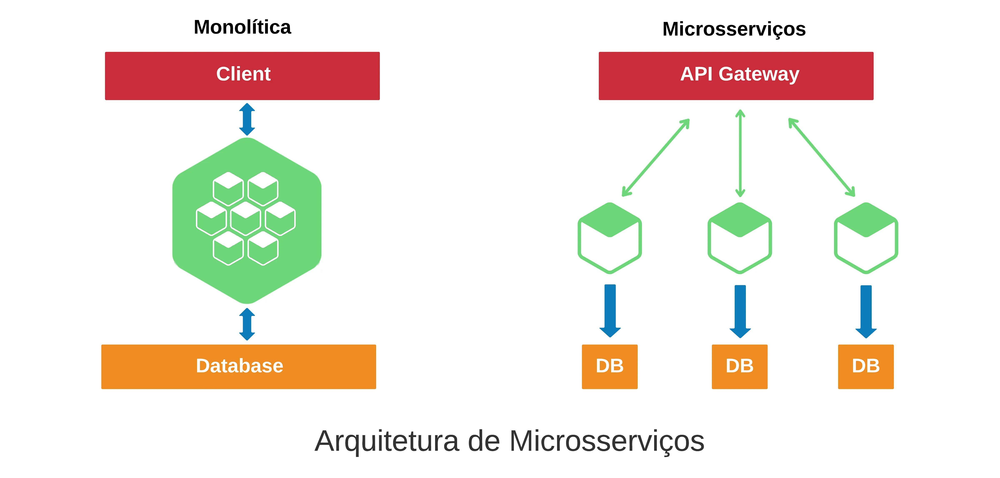

# OpenFinan
Api de Financiamento: Arquitetura Hexagonal

É um modelo de serviço que irá ajudá-lo a criar aplicativos mais adaptáveis e de fácil manutenção utilizando como base a arquitetura hexagonal.

Arquitetura hexagonal, consiste em dividir uma aplicação em camadas de acordo com suas responsabilidades e enfatizar uma camada em especial, onde ficará a lógica principal da aplicação, a camada de domínio ou domain (do termo original).

O objetivo da arquitetura hexagonal é encapsular a lógica, de maneira que nada externo acesse-a diretamente, então, o meio de um usuário acessar uma informação gerada pela camada de domínio é através de um serviço. Ou seja, externamente, conheceremos apenas a camada de serviço, o objetivo e não expor publicamente nenhuma informação sequer diretamente da camada de domínio

## Projeto OpenFinan
A ideia deste projeto é ter uma base para a criação de Apis seguindo um modelo maduro e de fácil adaptação,
utilizado sagger para facilitar os teste das chamada aos endpoints.

A estrutura do projeto está dividida em 03 (três) camadas, sendo elas: Core, Infra e Presenter.
### Core
Camada responsável por toda a regra de negócio. Nela estão contidos os projetos de:

#### Domain: 
 > Projeto na qual são trabalhados os modelos de negócio além das interfaces de Serviços, Repositórios, Adaptadores. No projeto de domínio criamos também as classes responsável por gerenciar nossas exceções.

#### Application:
 > Projeto responsável por trabalhar todas nossas regras de negócio. Nele realizamos a implementação da interface IService na qual orquestramos nossos modelos, interfaces de repositório e adaptadores.
 > Neste projeto também encontra-se uma pasta chamada "Microsoft.Extensions.DependencyInjection" e uma classe com o sufixo "ServiceCollectionExtensions". Esta classe é respnsável por realizar o registro das dependências do projeto.

### Infra
 > Camada responsável por fornecer acesso aos dados hospedados dentro dos limites do domínio. Nela está a implementação real das interfaces de repositório providas pelo domínio. Nela encontramos também implementação para envio de email, logs e qualquer comunicação com apis ou componentes de terceiro através de adaptadores - Adapters.
 > Nesta camada, temos os projetos de Repository como exemplos.

## Conecte-se comigo

## Tecnologia
 

  

## Processo para iniciar a criação do projeto, comandos dotnet :
Comandos utilizado para iniciar o projeto utilizando o VS Code.

- dotnet new sln --name "OpenFinan".  
- dotnet new webapi --name "OpenFinan.WebApi" --language "C#" --framework "net8.0".  
- dotnet new classlib --name "OpenFinan.Domain" --language "C#" --framework "net8.0".  
- dotnet new classlib --name "OpenFinan.Infra.Repository" --language "C#" --framework "net8.0".  
- dotnet new classlib --name "OpenFinan.DomainBase.Exceptions" --language "C#" --framework "net8.0".   
- dotnet new classlib --name "OpenFinan.Application" --language "C#" --framework "net8.0".  

## Processo de compilação e execução
Processo de utlização de containers(containerd), para compilar basta seguir os seguintes passos.

#### Criando a imagem do container
>$ nerdctl compose build

#### Rodar no container docker
>$ nerctl compose up -d

## Kubernetes

#### Entrar no Docker Hub 
>$ nerdctl login

#### Fazer upload das imagens para o Docker Hub
>$ nerdctl tag controlefinanceiro [YOUR DOCKER USER NAME]/controlefinanceiro
>$ nerdctl push [YOUR DOCKER USER NAME]/controlefinanceiro

#### Implantar e executar o microsserviço de back-end
>$ kubectl apply -f backend-deploy.yml

#### Implantar e executar o microsserviço de SQL
>$ kubectl apply -f mysql-deployment.yml
> para acessar a aplicação utilizar a seguinte url http://localhost:4200/swagger/index.html para acessar os endpoint pelo swagger

## Consulta para identificação de clientes 

- src/docker/sp/sp_lista4clientessematraso.sp  
- src/docker/sp/sp_listaclientesSP60.sp  

# Microsserviços

> A arquitetura de microsserviços consiste em um conjunto de serviço independentes e com escopo limitado a uma unica função comercial. Os microsserviços permitem que os aplicativos grande seja separado em partes independentes menores, com cada parte tendo sua própria responsabilidade.  

### Vantagem   
- Facilita as atualizações e manutenção mais eficaz na solução dos problemas.  
- Independetes de tecnologias na solução, podendo ter diversas tecnologia e linguagem de programação.  
- Facilidade em escalar os serviços.  

No desenho abaixo mostra a diferencia de um sistema monolitico e um sistema microsserviços.  

### Exemplo : OpenFinan - Solicitação de Crédito (Financiamento)   
  
#### Aplicação Monolitica:  
> Utiliza uma unica linguagem para sua respectiva funcionalidade (Front e Back).  

- FrontEnd (Angular, React, Html, ...)  
  - Telas do cadastro de cliente, financiamento   
- BackEnd (Java, C#, Python, ...)   
  - Api cliente, financiamento, parcelas  

#### Aplicação Microsserviços:  
> Possibilita a utilização de diferentes tecnologias e linguagem.
- Backend   
  - Serviços de Usuários (JAVA)  
    > Gerencia informações dos usuários, como cadastro, atualizações, acessar.  
  - Serviços de Clientes (C#)   
    > Gerencia informações dos clientes, como cadastro e atualizações de perfil.  
  - Serviços de Financiamento (JAVA)   
    > Responsável por gerenciar todos os aspectos dos financiamento, incluindo aprovação, status e histórico.  
  - Serviços de Avaliação de Crédito (PYTHON)   
    > Avalia a capacidade de crédito dos clientes usando dados internos e externos.  

Fonte https://medium.com/@marcelomg21/arquitetura-de-microsservi%C3%A7os-bc38d03fbf64
